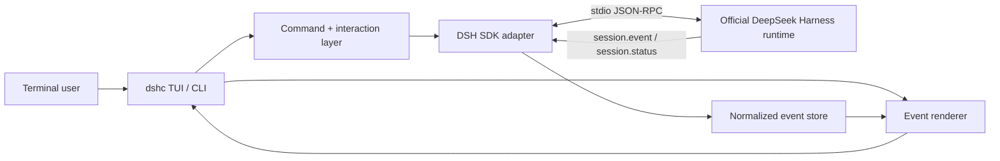

# DeepSeek Harness CLI

> An unofficial, terminal-native interactive frontend for [DeepSeek Harness](https://github.com/deepseek-ai/deepseek-harness), inspired by the ergonomics of Codex CLI and Claude Code.

**Status: pre-alpha / architecture bootstrap. Not ready for installation yet.**

[简体中文](README.zh-CN.md) · [Architecture](docs/ARCHITECTURE.md) · [Protocol](docs/PROTOCOL.md) · [Roadmap](docs/ROADMAP.md) · [Development](docs/DEVELOPMENT.md)

## Why this project exists

DeepSeek Harness (`dsh`) is an open-source, plugin-first agent harness developed by DeepSeek AI. Its shipped interactive product is currently the Web UI; it also exposes ACP, stdio JSON-RPC SDK, and a one-shot headless CLI. The upstream project intentionally removed its previous TUI package, leaving no maintained interactive terminal frontend.

This project fills that specific gap without forking the Harness core.

The goal is a thin, terminal-native host that:

- launches or connects to an official DeepSeek Harness runtime;
- renders the durable session/event stream as a readable coding-agent transcript;
- supports multi-turn interactive prompts, sessions, subagents, tools and approvals;
- keeps the Harness plugin/runtime architecture upstream-owned;
- behaves like a terminal product rather than a browser UI wrapped in a terminal.

## Project boundaries

### We are building

- a persistent interactive CLI/TUI;
- a renderer for Harness session and agent events;
- terminal commands such as `/model`, `/session`, `/resume`, `/agents`, `/clear` and `/help`;
- a small compatibility layer around the official SDK/runtime boundary;
- safe terminal UX for tool execution, approvals, failures and runtime shutdown;
- cross-platform support, with Windows as a first-class target.

### We are not building

- a fork of DeepSeek Harness;
- a replacement agent loop, model adapter, tool registry or persistence engine;
- another browser UI;
- a second implementation of DeepSeek's model protocol;
- an application that pretends to be an official DeepSeek product.

## Upstream facts that shape the design

At project bootstrap (2026-08-20), upstream DeepSeek Harness is `0.1.0-rc.8` and explicitly in developer preview with compatibility-breaking changes expected.

The relevant supported surfaces are:

- **Web UI** — the shipped interactive frontend;
- **headless profile** — one submitted task, one final stdout result, no interactive follow-up;
- **stdio JSON-RPC SDK runtime** — intended for out-of-process clients;
- **TypeScript SDK client** — can drive a Harness runtime subprocess and consume session/subagent notifications;
- **ACP** — another supported non-Web integration surface.

The upstream JSON-RPC wire is intentionally small today: `initialize`, `session/prompt`, `shutdown`, plus session-status/event and subagent notifications. It currently has no per-prompt cancellation, no per-session close method and no negotiated protocol version. Those limitations are first-class design constraints here, not details to hide.

See [Upstream compatibility](docs/UPSTREAM-COMPATIBILITY.md).

## Proposed architecture



The key rule is simple: **the terminal owns presentation and interaction; Harness owns agent behavior.**

We will prefer the official `@deepseek-ai/dsh-sdk-client` and official JSON-RPC runtime composition over importing internal Harness packages. If an upstream pre-release break forces a temporary adapter, it stays isolated behind `src/upstream/` and is documented in the compatibility matrix.

## Target terminal experience

```text
DeepSeek Harness Console                         V4-Pro
workspace  E:\project                     session  8b72…
──────────────────────────────────────────────────────

> inspect the failing tests and explain the root cause

● Exploring repository
  ├─ read package.json
  ├─ search src/
  └─ run pnpm test

● Found 2 failing tests
  The failure is caused by ...

> fix the first one

● Editing src/...
● Running tests...
✓ 42 passed

> /agents
> /session
> /model
```

The final appearance is intentionally not frozen yet. Transcript correctness, interruption behavior and tool-state clarity come before decoration.

## Command name

The upstream package already owns the `dsh` executable, so this project must not shadow it. The working binary name is:

```sh
dshc
```

`dshc` means **DeepSeek Harness Console**. The package name and binary name will be finalized before the first public package release.

## Repository status

No runtime code has been published yet. The repository is currently in **M0 — contract and architecture lock**.

The first implementation milestone is deliberately small:

1. scaffold TypeScript, tests and CI;
2. boot an official JSON-RPC Harness runtime;
3. complete `initialize`;
4. submit one prompt;
5. stream and render the resulting session events;
6. shut down cleanly on Linux, macOS and Windows.

Only after that vertical slice works do we add full-screen TUI behavior.

See the detailed [development roadmap](docs/ROADMAP.md).

## Documentation

- [Documentation index](docs/README.md)
- [Architecture](docs/ARCHITECTURE.md)
- [Upstream JSON-RPC protocol notes](docs/PROTOCOL.md)
- [Upstream compatibility policy](docs/UPSTREAM-COMPATIBILITY.md)
- [Development guide](docs/DEVELOPMENT.md)
- [Roadmap and milestone exit criteria](docs/ROADMAP.md)
- [Contributing](CONTRIBUTING.md)

## Design principles

1. **Upstream-first.** Use public DeepSeek Harness surfaces before writing adapters.
2. **Thin host.** Do not move agent semantics into the TUI.
3. **Event-native.** Render from session events rather than scraping final text.
4. **Safe by default.** Tool execution and approvals must be legible in a terminal.
5. **Cross-platform by construction.** Windows cannot be a post-release port.
6. **Fail loudly on protocol drift.** Never silently guess when upstream changes a wire contract.
7. **No fake stability.** Until upstream leaves developer preview, compatibility is pinned and tested rather than assumed.

## Upstream references

- [DeepSeek Harness](https://github.com/deepseek-ai/deepseek-harness)
- [Upstream architecture](https://github.com/deepseek-ai/deepseek-harness/blob/master/docs/architecture.md)
- [SDK protocol](https://github.com/deepseek-ai/deepseek-harness/blob/master/packages/sdk/protocol/README.md)
- [TypeScript SDK client](https://github.com/deepseek-ai/deepseek-harness/blob/master/packages/sdk/client/README.md)
- [JSON-RPC server](https://github.com/deepseek-ai/deepseek-harness/blob/master/packages/sdk/server/README.md)
- [Headless bundle](https://github.com/deepseek-ai/deepseek-harness/blob/master/packages/bundle/headless/README.md)
- [Upstream TUI removal decision](https://github.com/deepseek-ai/deepseek-harness/blob/master/.agents/notes/implemented/simplification/2026-08-04-remove-tui-package.md)

## License and affiliation

This repository is licensed under the [MIT License](LICENSE).

This is an independent community project. It is **not affiliated with, endorsed by, or maintained by DeepSeek AI**. “DeepSeek” and “DeepSeek Harness” are used only to describe interoperability with the upstream project.
