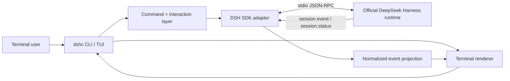

# DeepSeek Harness CLI

> An unofficial, terminal-native interactive frontend for [DeepSeek Harness](https://github.com/deepseek-ai/deepseek-harness), inspired by the ergonomics of modern coding-agent CLIs without copying their agent architecture.

**Status: pre-alpha. M0 development preparation is complete; M1 runtime implementation is ready to start. Not ready for installation yet.**

[简体中文](README.zh-CN.md) · [Product](docs/PRODUCT-SPEC.md) · [Why it is different](docs/DIFFERENTIATION.md) · [Architecture](docs/ARCHITECTURE.md) · [Protocol](docs/PROTOCOL.md) · [Roadmap](docs/ROADMAP.md) · [Status](docs/STATUS.md)

## Why this project exists

DeepSeek Harness (`dsh`) is an open-source, plugin-first agent harness developed by DeepSeek AI. Its maintained interactive product surface is the Web UI; it also exposes ACP, a stdio JSON-RPC SDK runtime, and a one-shot headless CLI. The upstream project removed its previous TUI package, leaving no maintained persistent interactive terminal frontend.

`dshc` fills that specific gap without forking the Harness core.

The product rule is simple:

> **Harness owns agent semantics; `dshc` owns terminal interaction, projection and presentation.**

The goal is a thin terminal host that:

- launches or connects to an official DeepSeek Harness runtime through supported public boundaries;
- renders the durable session/event stream as a readable coding-agent transcript;
- supports persistent multi-turn terminal work;
- exposes sessions, tools, subagents and runtime state instead of flattening Harness into generic chat;
- keeps the Harness plugin/provider/runtime architecture upstream-owned;
- behaves like a real command-line product rather than a browser UI embedded in a terminal.

## What makes `dshc` different

`dshc` is **not another independent coding-agent harness**.

Compared with the DSH Web UI, it is terminal-native and repository-local. Compared with the official headless mode, it is designed for persistent multi-turn work rather than one task/one final stdout result. Compared with Codex CLI or Claude Code, it does not replace the underlying agent semantics with its own loop: it stays thin over DeepSeek Harness and exposes Harness-native concepts. Compared with hackable harnesses such as Pi/OpenCode-style systems, extensibility should primarily come from DSH providers/plugins instead of building a second parallel agent ecosystem.

Its strongest differentiators are:

1. **DSH-native integration** through the official SDK/runtime boundary, not a raw DeepSeek model API wrapper.
2. **Event-native terminal state** built from Harness session/runtime notifications.
3. **Harness concepts as first-class UI objects**: sessions, tools, subagents, activity and future supported capabilities.
4. **Protocol-truthful UX**: no fake cancellation, no invented prompt/result causality, no silent protocol guessing.
5. **Observability as a product feature**: users should understand what the Harness is doing without reading JSON-RPC.
6. **Thin, replaceable frontend architecture** so upstream owns agent behavior and `dshc` can evolve independently as a terminal product.

See [Product differentiation](docs/DIFFERENTIATION.md).

## Project boundaries

### We are building

- a persistent interactive CLI/TUI;
- a renderer for Harness session and agent events;
- terminal-local commands for status/session/navigation and later supported Harness controls;
- a small compatibility layer around the official SDK/runtime boundary;
- safe terminal UX for tool execution, failures and runtime shutdown;
- cross-platform support, with Windows as a first-class blocking target.

### We are not building

- a fork of DeepSeek Harness;
- a replacement agent loop, model adapter, tool registry or persistence engine;
- another browser UI;
- a raw DeepSeek API chat wrapper;
- a custom credential vault before alpha;
- an application that pretends to be an official DeepSeek product.

## Upstream facts that shape the design

The M0 final review on 2026-08-20 targets upstream DeepSeek Harness `0.1.0-rc.8`, which is still developer preview.

The relevant public surfaces are:

- **Web UI** — maintained interactive frontend;
- **headless profile** — one submitted task, one final stdout result;
- **stdio JSON-RPC SDK runtime** — intended for out-of-process clients;
- **TypeScript SDK client** — drives a Harness runtime subprocess and consumes session/subagent notifications;
- **ACP** — another supported non-Web integration surface.

The current JSON-RPC wire exposes `initialize`, `session/prompt`, `shutdown`, plus session-status/event and subagent notifications. It has no per-prompt cancellation or per-session close method. `session/prompt` is an enqueue receipt rather than an exact assistant-result contract. Those limitations are first-class design constraints, not details to hide.

See [Upstream compatibility](docs/UPSTREAM-COMPATIBILITY.md) and the [M0 final review](docs/M0-REVIEW-2026-08-20.md).

## Proposed architecture



We prefer the official SDK/runtime boundary over private Harness imports. Upstream-specific/version-specific code stays isolated behind `src/upstream/`.

## Target terminal experience

```text
DeepSeek Harness Console                         V4-Pro
workspace  E:\project                     session  8b72…
──────────────────────────────────────────────────────

> inspect the failing tests and explain the root cause

● Exploring repository
  ├─ read package.json
  ├─ search src/
  └─ run pnpm test

● Found 2 failing tests
  The failure is caused by ...

> fix the first one

● Editing src/...
● Running tests...
✓ 42 passed

> /status
> /session
> /agents
```

The final appearance is intentionally not frozen. Transcript correctness, lifecycle behavior, tool-state clarity and terminal security come before decoration.

## Command name

The upstream package already owns the `dsh` executable. The working binary name is:

```sh
dshc
```

`dshc` means **DeepSeek Harness Console**. Package naming will be finalized before public alpha.

## Development status

M0 is complete. Development begins with [M1 — Runtime vertical slice, issue #10](https://github.com/1919-doomer/DeepseekHarness-CLI/issues/10).

The first executable task is [#2 — scaffold TypeScript/ESM project and pinned toolchain](https://github.com/1919-doomer/DeepseekHarness-CLI/issues/2).

M1 deliberately proves only the smallest complete path:

```text
launch official runtime
  -> initialize
  -> enqueue one prompt
  -> consume ordered session notifications
  -> project/render assistant output
  -> observe idle
  -> clean shutdown
```

No full-screen TUI framework is selected in M1. The runtime boundary is proven first with a plain event-native renderer.

## Documentation

- [Documentation index](docs/README.md)
- [Product specification](docs/PRODUCT-SPEC.md)
- [Product differentiation](docs/DIFFERENTIATION.md)
- [Architecture](docs/ARCHITECTURE.md)
- [Terminal UX contract](docs/UX-CONTRACT.md)
- [Upstream JSON-RPC protocol notes](docs/PROTOCOL.md)
- [Upstream compatibility policy](docs/UPSTREAM-COMPATIBILITY.md)
- [Dependency policy](docs/DEPENDENCY-POLICY.md)
- [Testing strategy](docs/TESTING-STRATEGY.md)
- [Threat model](docs/THREAT-MODEL.md)
- [Risk register](docs/RISK-REGISTER.md)
- [Development readiness](docs/DEFINITION-OF-READY.md)
- [Roadmap](docs/ROADMAP.md)
- [Current status](docs/STATUS.md)
- [Contributing](CONTRIBUTING.md)

## Design principles

1. **Upstream-first.** Use public DeepSeek Harness surfaces before writing adapters.
2. **Thin host.** Do not move agent semantics into the terminal frontend.
3. **Event-native.** Render from session/runtime events rather than scraping only final text.
4. **Protocol-truthful.** Never claim capabilities or causality the wire does not provide.
5. **Safe by default.** Untrusted output is sanitized and state-changing activity remains inspectable.
6. **Cross-platform by construction.** Windows cannot be a post-release port.
7. **Fail loudly on protocol drift.** Never silently guess when upstream changes a contract.
8. **No fake stability.** While upstream is developer preview, compatibility is pinned and tested rather than assumed.

## License and affiliation

This repository is licensed under the [MIT License](LICENSE).

This is an independent community project. It is **not affiliated with, endorsed by, or maintained by DeepSeek AI**. “DeepSeek” and “DeepSeek Harness” are used only to describe interoperability with the upstream project.