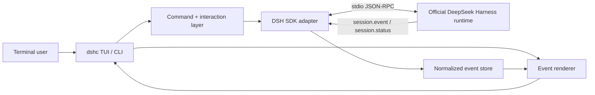

# DeepSeek Harness CLI

> 面向 [DeepSeek Harness](https://github.com/deepseek-ai/deepseek-harness) 的非官方、终端原生交互前端，交互目标参考 Codex CLI 与 Claude Code。

**当前状态：pre-alpha / 架构启动阶段，暂不建议安装使用。**

[English](README.md) · [架构](docs/ARCHITECTURE.md) · [协议](docs/PROTOCOL.md) · [路线图](docs/ROADMAP.md) · [开发说明](docs/DEVELOPMENT.md)

## 为什么做这个项目

DeepSeek Harness（`dsh`）是 DeepSeek AI 开源的插件化 Agent Harness。当前上游正式提供的交互入口以 Web UI 为主，同时还提供 ACP、stdio JSON-RPC SDK 与一次性 headless CLI。上游曾经实现过 TUI，但已经主动删除，不再把交互式终端作为受维护的产品界面。

这个项目只补这一块缺口：**在不 fork Harness 核心的前提下，为它提供真正终端原生、持续多轮的 CLI/TUI。**

目标包括：

- 启动或连接官方 DeepSeek Harness runtime；
- 把 durable session/event stream 渲染成易读的 coding-agent 终端对话；
- 支持持续多轮输入、session、subagent、tool 与 approval；
- Harness 继续负责 Agent loop、模型、工具、持久化与插件系统；
- 终端只负责交互和呈现，不把 Web 页面硬塞进终端。

## 项目边界

### 我们要做

- 持续交互式 CLI/TUI；
- Harness session / agent event renderer；
- `/model`、`/session`、`/resume`、`/agents`、`/clear`、`/help` 等终端命令；
- 对官方 SDK/runtime 的薄兼容层；
- 对工具执行、审批、错误和退出流程友好的终端 UX；
- Linux、macOS、Windows 跨平台支持，Windows 从第一天开始纳入测试。

### 我们不做

- DeepSeek Harness fork；
- 重新实现 Agent loop、模型 adapter、tool registry 或 persistence；
- 再做一个浏览器 UI；
- 重写 DeepSeek 模型协议；
- 冒充 DeepSeek 官方产品。

## 当前上游约束

项目启动时（2026-08-20），DeepSeek Harness 上游版本为 `0.1.0-rc.8`，官方明确标注为 developer preview，并警告会发生兼容性破坏。

对本项目最重要的上游入口是：

- **Web UI**：上游当前维护的交互式界面；
- **headless profile**：一次提交一个任务，最后输出一次结果，不支持持续交互；
- **stdio JSON-RPC SDK runtime**：供外部进程驱动 Harness；
- **TypeScript SDK client**：可以启动 Harness runtime 子进程并消费 session/subagent 通知；
- **ACP**：另一条非 Web 集成路径。

当前 JSON-RPC wire 很小：客户端主要使用 `initialize`、`session/prompt`、`shutdown`，服务端发送 session event/status 与 subagent 通知。协议目前没有 per-prompt cancel、没有 per-session close，也没有正式的协议版本协商。本项目会把这些当成架构约束，而不是在 UI 层假装它们不存在。

详见 [上游兼容策略](docs/UPSTREAM-COMPATIBILITY.md)。

## 计划架构



核心原则只有一句：**终端负责 presentation 与 interaction；Harness 负责 agent behavior。**

我们优先使用官方 `@deepseek-ai/dsh-sdk-client` 与官方 JSON-RPC runtime composition，而不是依赖 Harness 内部包。如果 developer preview 阶段的 breaking change 迫使我们加临时兼容层，它必须隔离在 `src/upstream/`，并记录进兼容矩阵。

## 目标终端体验

```text
DeepSeek Harness Console                         V4-Pro
workspace  E:\project                     session  8b72…
──────────────────────────────────────────────────────

> inspect the failing tests and explain the root cause

● Exploring repository
  ├─ read package.json
  ├─ search src/
  └─ run pnpm test

● Found 2 failing tests
  The failure is caused by ...

> fix the first one

● Editing src/...
● Running tests...
✓ 42 passed

> /agents
> /session
> /model
```

第一阶段不会优先追求视觉花哨。优先级是：事件是否正确、执行状态是否清楚、能否可靠中断、工具调用是否可追踪。

## 命令名

官方 `@deepseek-ai/dsh` 已经占用了 `dsh` 可执行命令，因此本项目不能覆盖它。当前工作名称是：

```sh
dshc
```

含义为 **DeepSeek Harness Console**。npm package 与 binary 的最终命名会在首个公开 release 前确定。

## 当前开发阶段

仓库目前处于 **M0 — Contract & Architecture Lock**，还没有发布运行时代码。

第一条实现链路必须保持最小：

1. 初始化 TypeScript、测试和 CI；
2. 启动官方 JSON-RPC Harness runtime；
3. 完成 `initialize`；
4. 提交一条 prompt；
5. 实时接收并渲染 session events；
6. 在 Linux、macOS、Windows 上干净退出。

只有这条 vertical slice 验证通过，才进入 full-screen TUI。

详细计划见 [ROADMAP](docs/ROADMAP.md)。

## 文档

- [文档索引](docs/README.md)
- [架构](docs/ARCHITECTURE.md)
- [JSON-RPC 协议说明](docs/PROTOCOL.md)
- [上游兼容策略](docs/UPSTREAM-COMPATIBILITY.md)
- [开发指南](docs/DEVELOPMENT.md)
- [开发路线与里程碑验收条件](docs/ROADMAP.md)
- [贡献指南](CONTRIBUTING.md)

## 设计原则

1. **Upstream-first**：先使用官方公开接口，再考虑兼容适配。
2. **Thin host**：不把 Agent 语义搬进 TUI。
3. **Event-native**：从 session event 渲染，不靠抓取最终文本。
4. **Safe by default**：工具执行和审批在终端必须清楚可见。
5. **Cross-platform by construction**：Windows 不能留到发布前再适配。
6. **Fail loudly on protocol drift**：上游协议变化时明确报错，不静默猜测。
7. **No fake stability**：上游仍在 developer preview 时，靠 pin + tests 管兼容，不假装稳定。

## 上游资料

- [DeepSeek Harness](https://github.com/deepseek-ai/deepseek-harness)
- [上游架构文档](https://github.com/deepseek-ai/deepseek-harness/blob/master/docs/architecture.md)
- [SDK protocol](https://github.com/deepseek-ai/deepseek-harness/blob/master/packages/sdk/protocol/README.md)
- [TypeScript SDK client](https://github.com/deepseek-ai/deepseek-harness/blob/master/packages/sdk/client/README.md)
- [JSON-RPC server](https://github.com/deepseek-ai/deepseek-harness/blob/master/packages/sdk/server/README.md)
- [Headless bundle](https://github.com/deepseek-ai/deepseek-harness/blob/master/packages/bundle/headless/README.md)
- [上游删除 TUI 的设计记录](https://github.com/deepseek-ai/deepseek-harness/blob/master/.agents/notes/implemented/simplification/2026-08-04-remove-tui-package.md)

## License 与关系说明

本仓库采用 [MIT License](LICENSE)。

本项目为独立社区项目，**不隶属于、不代表、也未获得 DeepSeek AI 官方背书**。“DeepSeek”与“DeepSeek Harness”仅用于说明与上游项目的互操作关系。
