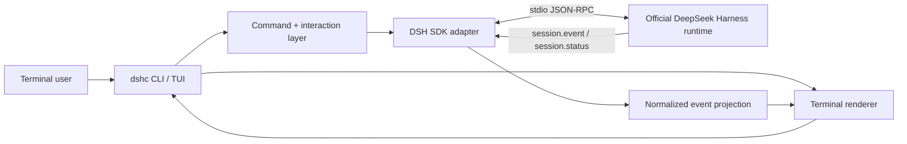

# DeepSeek Harness CLI

> 面向 [DeepSeek Harness](https://github.com/deepseek-ai/deepseek-harness) 的非官方、终端原生交互前端。借鉴现代 coding-agent CLI 的交互经验，但不复制它们的 Agent 架构。

**当前状态：pre-alpha。M0 开发前准备已经完成，M1 runtime 实现可以开始；暂不可安装使用。**

[English](README.md) · [产品规格](docs/PRODUCT-SPEC.md) · [项目差异化](docs/DIFFERENTIATION.md) · [架构](docs/ARCHITECTURE.md) · [协议](docs/PROTOCOL.md) · [路线图](docs/ROADMAP.md) · [当前状态](docs/STATUS.md)

## 为什么做这个项目

DeepSeek Harness（`dsh`）是 DeepSeek AI 开源的插件化 Agent Harness。当前受维护的交互入口主要是 Web UI，同时还提供 ACP、stdio JSON-RPC SDK runtime 和一次性 headless CLI。上游曾实现 TUI，但已经删除，目前没有一个受维护的持续交互式终端前端。

`dshc` 只补这一块缺口，并坚持一个边界：

> **Harness 负责 Agent 语义；`dshc` 负责终端交互、状态投影与呈现。**

因此我们不会 fork Harness 核心，也不会重新实现 Agent loop。

## 这个项目真正不同在哪里

`dshc` 的定位不是“再做一个 coding agent”。它是 **DeepSeek Harness 的 terminal-native console**。

与 DSH Web UI 相比，它是终端原生、适合仓库目录、编辑器 Terminal、SSH/远程 shell 等工作流；与官方 headless 模式相比，它面向持续多轮交互，而不是一次任务后打印最终结果；与 Codex CLI / Claude Code 相比，它不拥有另一套 Agent loop，而是把 DeepSeek Harness 本身的 session、tool、subagent、runtime state 等概念带进终端；与 Pi/OpenCode 一类 Harness 相比，它不准备再建立第二套 provider/tool/plugin 生态，而是尽量复用 DSH 的插件和 provider 能力。

核心差异化是：

1. **DSH-native**：通过官方 Harness SDK/runtime 边界工作，不是 DeepSeek API 聊天壳。
2. **Event-native**：终端状态来自 Harness session/runtime event，而不是只拿最终 assistant 文本。
3. **Harness 概念一等化**：session、tool、subagent、activity/runtime state 在 UI 中明确可见。
4. **协议诚实**：上游没有 cancel 就不假装有；`session/prompt` 只是 enqueue receipt，就不包装成严格一问一答协议。
5. **Observability-first**：用户应当看得懂 Harness 正在干什么，而不是只看到 spinner。
6. **薄前端**：Agent 行为由上游负责，终端 renderer/TUI 可替换而不改变 Harness 语义。

详见 [项目差异化](docs/DIFFERENTIATION.md)。

## 项目边界

### 我们要做

- 持续交互式 CLI/TUI；
- Harness session / agent event renderer；
- 对 session、runtime、tool、subagent 状态清晰的终端呈现；
- 对官方 SDK/runtime 的薄兼容层；
- 可靠的错误、退出、进程生命周期与终端安全处理；
- Windows、Linux、macOS 跨平台支持，其中 Windows 从 M1 开始就是 blocking target。

### 我们不做

- DeepSeek Harness fork；
- 重写 Agent loop、模型 adapter、tool registry 或 persistence；
- 再做一个浏览器 UI；
- 纯 DeepSeek API 聊天客户端；
- alpha 前自建 API Key 密钥库；
- 冒充 DeepSeek 官方产品。

## 当前上游约束

2026-08-20 的 M0 最终复核基线是 DeepSeek Harness `0.1.0-rc.8`，仍属于 developer preview。

与本项目直接相关的公开入口包括：

- **Web UI**：上游维护的交互式前端；
- **headless profile**：一次任务、一次最终 stdout；
- **stdio JSON-RPC SDK runtime**：供外部进程驱动 Harness；
- **TypeScript SDK client**：启动 Harness runtime 子进程并消费 session/subagent 通知；
- **ACP**：另一条公开集成边界。

当前 JSON-RPC 主要提供 `initialize`、`session/prompt`、`shutdown`，以及 session event/status 和 subagent 通知。没有 per-prompt cancel、没有 per-session close；`session/prompt` 返回的是 enqueue receipt，而不是某条 assistant response 的严格结果 ID。

这些限制会直接进入 UX 和状态机设计，而不会在 UI 中被“补出来”。

## 架构



上游版本/协议相关代码统一隔离在 `src/upstream/`。终端层依赖本项目自己的 normalized projection，不直接依赖 Harness 私有实现对象。

## 目标终端体验

```text
DeepSeek Harness Console                         V4-Pro
workspace  E:\project                     session  8b72…
──────────────────────────────────────────────────────

> inspect the failing tests and explain the root cause

● Exploring repository
  ├─ read package.json
  ├─ search src/
  └─ run pnpm test

● Found 2 failing tests
  The failure is caused by ...

> fix the first one

● Editing src/...
● Running tests...
✓ 42 passed

> /status
> /session
> /agents
```

最终外观暂不锁定。协议正确性、进程生命周期、tool/subagent 状态、终端安全优先于视觉装饰。

## 命令名

官方已经使用 `dsh`，因此当前工作 binary 为：

```sh
dshc
```

含义为 **DeepSeek Harness Console**。npm package 名称会在公开 alpha 前最终确定。

## 当前开发阶段

M0 已完成。当前进入 **M1 — Runtime vertical slice**，主追踪 Issue 为 [#10](https://github.com/1919-doomer/DeepseekHarness-CLI/issues/10)。

第一个开发任务是 [#2 — TypeScript/ESM 工程与固定 toolchain](https://github.com/1919-doomer/DeepseekHarness-CLI/issues/2)。

M1 只证明最小闭环：

```text
启动官方 runtime
  -> initialize
  -> enqueue prompt
  -> 接收有序 session notifications
  -> 投影并输出 assistant 内容
  -> 观察 idle
  -> 干净 shutdown
```

M1 不选择 full-screen TUI 框架。先用 plain event-native renderer 验证 runtime boundary；到 M3 再依据真实需求选择 Ink 或其他方案。

## 文档

- [文档索引](docs/README.md)
- [产品规格](docs/PRODUCT-SPEC.md)
- [项目差异化](docs/DIFFERENTIATION.md)
- [架构](docs/ARCHITECTURE.md)
- [终端 UX 契约](docs/UX-CONTRACT.md)
- [JSON-RPC 协议说明](docs/PROTOCOL.md)
- [上游兼容策略](docs/UPSTREAM-COMPATIBILITY.md)
- [依赖策略](docs/DEPENDENCY-POLICY.md)
- [测试策略](docs/TESTING-STRATEGY.md)
- [威胁模型](docs/THREAT-MODEL.md)
- [风险登记](docs/RISK-REGISTER.md)
- [M1 Definition of Ready](docs/DEFINITION-OF-READY.md)
- [开发路线](docs/ROADMAP.md)
- [当前状态](docs/STATUS.md)
- [贡献指南](CONTRIBUTING.md)

## 设计原则

1. **Upstream-first**：先使用官方公开接口。
2. **Thin host**：Agent 语义不搬进终端前端。
3. **Event-native**：从 session/runtime event 构建 UI。
4. **Protocol-truthful**：不宣称 wire contract 没有提供的能力。
5. **Safe by default**：不可信输出必须经过终端安全处理，状态改变应可观察。
6. **Cross-platform by construction**：Windows 不是发布前再补的 port。
7. **Fail loudly on protocol drift**：兼容变化明确失败，不静默猜测。
8. **No fake stability**：上游 developer preview 阶段依靠版本 pin + tests 管理兼容。

## License 与关系说明

本仓库采用 [MIT License](LICENSE)。

本项目为独立社区项目，**不隶属于、不代表、也未获得 DeepSeek AI 官方背书**。“DeepSeek”与“DeepSeek Harness”仅用于说明与上游项目的互操作关系。