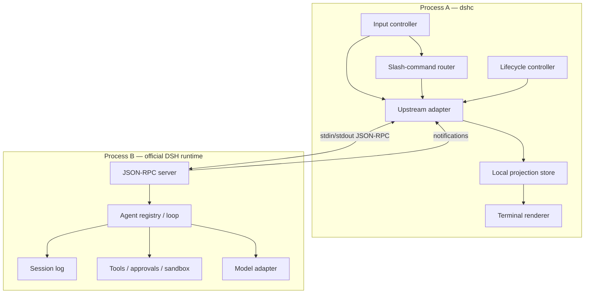

# Architecture

## 1. Purpose

DeepSeek Harness CLI (`dshc`) is a terminal host for the official DeepSeek Harness runtime. It is intentionally not a fork of the Harness agent loop.

The architectural objective is to preserve this separation:

> **Harness owns agent semantics; `dshc` owns terminal interaction and presentation.**

That boundary is the main defense against upstream churn. DeepSeek Harness is currently a developer preview, and its internal plugin tree changes quickly. The terminal frontend should therefore depend on the narrowest public process boundary available rather than import implementation internals.

## 2. Upstream architecture we rely on

DeepSeek Harness is built on Cordis and composes model adapters, tools, sessions, the agent loop and other capabilities as plugins. Its session log is append-only and is the source from which model history, replay, persistence and UI projections are derived.

For external hosts, the most relevant upstream surfaces are:

- `@deepseek-ai/dsh-sdk-client` — TypeScript client for driving a Harness runtime subprocess;
- `dsh-jsonrpc-agent` — runtime entry point that boots an external `cordis.yml` and exposes JSON-RPC over stdio;
- `@deepseek-ai/dsh-sdk-jsonrpc-server` — the JSON-RPC serving plugin;
- the SDK protocol — newline-delimited JSON-RPC 2.0 frames over stdin/stdout;
- durable `session.event` notifications and whole-agent `session.status` notifications.

Primary sources:

- https://github.com/deepseek-ai/deepseek-harness/blob/master/docs/architecture.md
- https://github.com/deepseek-ai/deepseek-harness/blob/master/packages/sdk/client/README.md
- https://github.com/deepseek-ai/deepseek-harness/blob/master/packages/sdk/server/README.md
- https://github.com/deepseek-ai/deepseek-harness/blob/master/packages/sdk/protocol/README.md
- https://github.com/deepseek-ai/deepseek-harness/blob/master/packages/examples/jsonrpc-demo/README.md

## 3. Process model

The default architecture uses two processes.



### Why two processes

1. It follows the upstream SDK design instead of importing private Harness modules.
2. A runtime crash cannot corrupt the terminal renderer process directly.
3. stdout has a single well-defined role on the Harness side: JSON-RPC frames only.
4. Process teardown provides a coarse fallback for cancellation while upstream lacks prompt-cancel/session-close methods.
5. Upstream compatibility can be tested at the adapter boundary.

## 4. Runtime launch strategy

The TypeScript SDK client requires an explicit launch command and arguments. It does not currently resolve a packaged runtime automatically. Upstream also ships a `dsh-jsonrpc-agent` binary via the JSON-RPC demo package; that binary requires an external Cordis config and has no built-in default configuration.

Therefore M1 must validate one supported deployment path before the TUI is built:

### Preferred path

Ship a small `runtime/cordis.yml` composition in this repository and launch the official published JSON-RPC runtime entry point with that config.

Conceptually:

```text
dshc
  └─ spawn official dsh-jsonrpc-agent <our cordis.yml>
       └─ official Harness plugins
```

The config must include the official JSON-RPC server and the standard capabilities required for a coding agent. It must not compose a stdout logger because stdout is the wire transport.

### Fallback path

If published-package resolution makes the preferred path impractical during developer preview, isolate the launch logic behind `src/upstream/runtime-launcher.ts` and keep all version-specific details there. Do not spread private import paths through the renderer or command code.

### Rejected path

Forking DeepSeek Harness or copying its deleted TUI code is not the default plan. The upstream removal note explicitly says a future terminal frontend should start from its actual host and interaction requirements instead of inheriting the removed implementation by default.

## 5. Local module boundaries

The planned source layout is:

```text
src/
├─ cli/
│  ├─ bin.ts                 # executable entry
│  ├─ args.ts                # command-line flags
│  └─ commands.ts            # non-interactive subcommands
├─ tui/
│  ├─ app.tsx                # top-level terminal application
│  ├─ input.tsx              # prompt editor / key handling
│  ├─ transcript.tsx         # transcript projection
│  ├─ status.tsx             # model/session/workspace status
│  └─ components/            # tool calls, errors, approvals, subagents
├─ session/
│  ├─ projection.ts          # normalized terminal-facing state
│  ├─ reducer.ts             # event -> projection transition
│  └─ selectors.ts           # render-friendly selectors
├─ commands/
│  ├─ registry.ts            # slash-command definitions
│  └─ handlers/              # /model, /session, /agents, ...
├─ upstream/
│  ├─ client.ts              # wrapper over official SDK client
│  ├─ protocol.ts            # local guards around upstream wire types
│  ├─ runtime-launcher.ts    # process launch details
│  └─ compatibility.ts       # supported upstream version checks
├─ lifecycle/
│  ├─ shutdown.ts            # graceful shutdown + escalation
│  └─ signals.ts             # SIGINT/Windows console behavior
└─ config/
   ├─ schema.ts
   └─ load.ts

runtime/
└─ cordis.yml                # official DSH runtime composition
```

The exact file tree can change, but the dependency direction should not:

```text
TUI / commands
      ↓
session projection
      ↓
upstream adapter
      ↓
official SDK/runtime
```

TUI components must not import Harness internals directly.

## 6. Event model

The terminal transcript is a projection of upstream events, not an independent conversation database.

The adapter receives:

- `session.event` — durable event envelopes;
- `session.status` — whole-agent `running` / `idle` transitions;
- `subagent.started`;
- `subagent.finished` for in-process children.

These are normalized into terminal-facing state.

Example conceptual flow:

```text
session.event(turn/start)
session.event(user/message)
session.event(step/start)
session.event(assistant/chunk)*
session.event(tool/call)
session.event(tool/result)
session.event(assistant/message)
session.event(step/end)
session.event(turn/end)
session.status(idle)
```

`dshc` must preserve upstream ordering. It may collapse or group events visually, but it must not invent causal relationships that the wire does not provide.

### Important consequence

`session/prompt` returns an enqueue receipt (`messageId`), not the assistant response to that prompt. The high-level SDK defines an owned activity interval ending at the next whole-agent idle state, but even that final response is not a formally prompt-attributed result.

Therefore terminal state should use language like “current activity” or “turn interval”, not expose a false `prompt -> exact response` protocol abstraction.

## 7. Rendering model

The renderer has three layers.

### 7.1 Durable transcript

Long-lived content that should remain scrollable:

- user messages;
- committed assistant messages;
- tool calls/results;
- errors;
- subagent lifecycle summaries;
- explicit approval decisions.

### 7.2 Ephemeral activity

Transient state that should update in place:

- current phase;
- streaming assistant chunks;
- spinner/elapsed time;
- active tool/subagent count;
- runtime/model/session indicator.

### 7.3 Input surface

The prompt editor and slash-command UI. It must remain responsive while the agent is running so future steering/queued-message behavior can be supported without rebuilding the renderer.

## 8. Slash commands

Human commands are local terminal commands unless they explicitly map to an upstream capability.

Initial categories:

- `/help` — local help;
- `/clear` — clear terminal projection only, not Harness history;
- `/session` — display current session information;
- `/new` — create/select a new local session id;
- `/resume` — reopen a known persisted session when supported by the runtime composition;
- `/agents` — display known subagent tree;
- `/model` — inspect/change configured provider/model route when safe to do so;
- `/status` — runtime/process/session state;
- `/exit` — graceful shutdown.

Commands that mutate upstream state must be implemented only when the public SDK or an explicit supported DSH command/service provides a reliable contract.

## 9. Cancellation and Ctrl+C

This is one of the project's highest-risk areas.

Current upstream SDK protocol has no prompt-cancel method and no session-close method. A client can abandon in-flight work by closing the runtime process.

The initial policy is therefore:

1. first Ctrl+C while idle clears current input;
2. first Ctrl+C while running requests a local “interrupt pending” state;
3. because there is no upstream prompt-cancel wire method, M1/M2 may terminate and restart the runtime only if the user confirms destructive interruption or configuration enables it;
4. second Ctrl+C within a short interval escalates toward process termination;
5. SIGTERM/EOF/shutdown behavior must be tested independently on Windows and POSIX systems.

We must not display “cancelled successfully” unless the runtime actually reached a known terminal condition.

A future upstream cancel method should replace the process-level fallback behind the adapter without changing the TUI contract.

## 10. Persistence and sessions

DeepSeek Harness owns durable session storage. `dshc` may keep small terminal preferences and an index of recently used session ids, but it must not create a second authoritative chat-history store.

Local state may include:

```text
~/.config/dshc/
├─ config.json
├─ recent-sessions.json
└─ ui-state.json
```

Actual paths will follow platform conventions and will not be finalized until M3.

Never store API keys in these files unless a dedicated credential mechanism is designed and reviewed. Prefer the upstream Harness credential/provider system.

## 11. Security boundaries

A coding agent can read files, modify files and execute commands. Terminal UX must make these capabilities legible.

Rules:

- never hide a tool invocation that changes state;
- distinguish read-only operations from writes and subprocess execution;
- preserve upstream approval decisions rather than auto-approve in the UI layer;
- never echo credentials or full environment variables into debug logs;
- treat tool output and repository content as untrusted display data;
- sanitize terminal control sequences before rendering untrusted text;
- cap retained in-memory streaming buffers;
- keep stderr diagnostics separate from the Harness stdout JSON-RPC channel.

Terminal escape-sequence sanitization is a release blocker, not polish.

## 12. Cross-platform requirements

Windows is a first-class target because terminal/process behavior differs materially from POSIX.

The architecture must avoid assumptions such as:

- Unix-only signals;
- `/bin/sh` always existing;
- ANSI behavior being identical across terminals;
- POSIX path parsing;
- shell quoting as a single universal grammar.

CI should eventually cover at least:

- Ubuntu latest;
- macOS latest;
- Windows latest.

Node compatibility should follow the supported range of the pinned DeepSeek Harness release unless a narrower constraint is justified.

## 13. Observability

Development builds should be able to write structured diagnostics to a file or stderr without corrupting the JSON-RPC channel.

Useful fields:

- upstream DSH version;
- runtime command and config path, excluding secrets;
- JSON-RPC method names and ids;
- session ids;
- notification counts;
- renderer state transitions;
- process exit reason/code.

Raw model/tool content should not be logged by default.

## 14. Architectural invariants

The following are non-negotiable unless an explicit architecture change is documented:

1. `dshc` does not fork the Harness agent loop.
2. Harness stdout is reserved for JSON-RPC when using the SDK runtime.
3. The renderer consumes normalized events, not private Harness objects.
4. Upstream-specific code stays behind `src/upstream/`.
5. Terminal state never claims stronger prompt/response causality than the protocol provides.
6. Cancellation semantics are explicit about what is and is not supported.
7. User-visible tool execution remains inspectable.
8. Version drift fails clearly rather than silently degrading.
