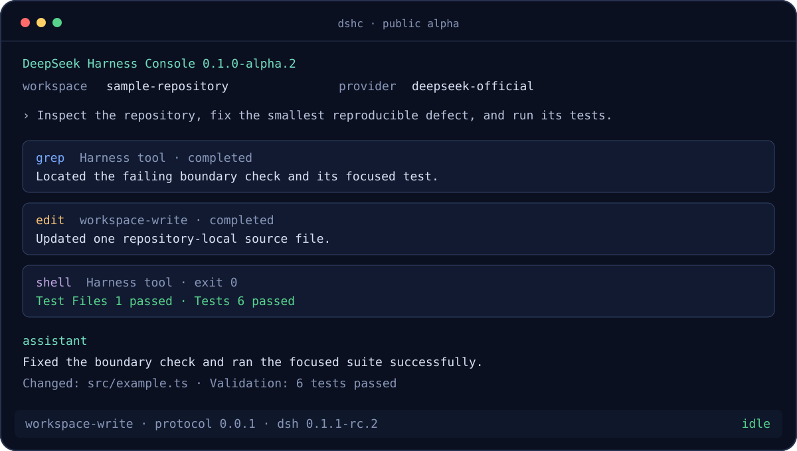

# Public-alpha demo

This is the repeatable 60–90 second public-alpha demonstration. Run it from the
published npm package, not from a source checkout, and use a disposable sample
repository containing no secrets.

## Recording flow

```bash
npm install --global dshc@alpha
dshc --version
dshc doctor
cd /path/to/disposable-repository
dshc
```

Submit one bounded task:

```text
Inspect this repository, fix the smallest clearly reproducible defect, run the
relevant tests, and summarize the files changed. Do not access paths outside
this repository.
```

The recording should visibly demonstrate:

1. `0.1.0-alpha.1` and a successful initialize-only doctor preflight;
2. repository cwd, provider/model and Harness runtime identity;
3. Harness-owned filesystem/search/platform-shell activity;
4. a safe edit and its relevant test result;
5. subagent/skill activity only when the task genuinely uses it;
6. deterministic `/exit` cleanup with the terminal restored.

Do not manufacture tool events for the recording. Do not show an API key,
environment dump, private repository, username, home path, session identifier
or internal endpoint. Crop or redact those values before publishing.

## Representative terminal frame



The SVG is a documentation illustration of the verified flow, not a replacement
for the recorded installed-package acceptance run.
